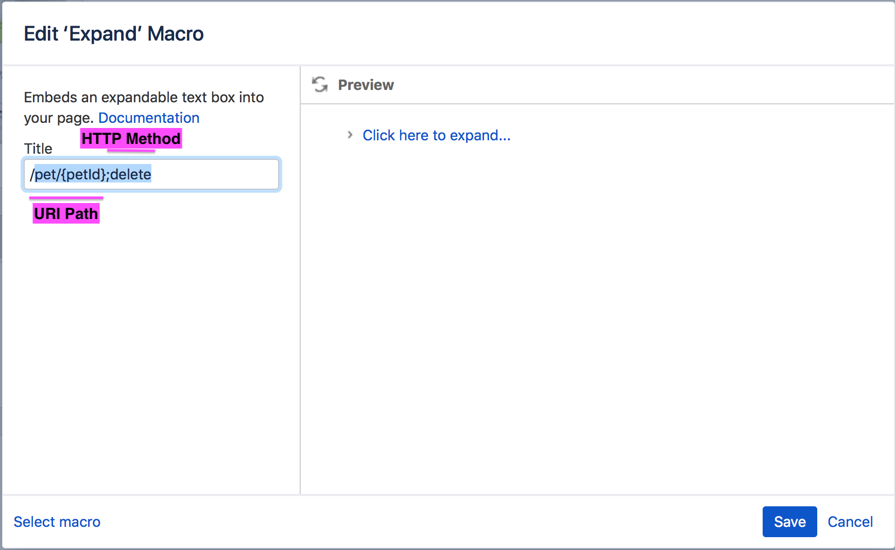

## API Documentation in Confluence

[](https://codeclimate.com/github/namuan/swagger-confluence/maintainability)

A Python script to update swagger documentation in a confluence page. 

Instead of replacing the whole page, this will only replace anchored documentation within Confluence `expand` macro blocks.

#### Setting up a confluence page:

This script will work with any confluence page as long it can find `expand` block with a specific title format

```
<uri-path-in-swagger>;<http-method>
```
Although this can be changed by updating the split constant in `confluence_page.py`



#### Usage:

Before running the script, make sure you have the following environment variables 

|Name          | Value |
|:------------- | :-------------|
|CONFLUENCE_BASE | http://docker-ip:8090/rest/api|
|CONFLUENCE_USER | admin|
|CONFLUENCE_PASS | password|

or you can set the variables in any file and source it when running the script

```
$ cat .env
CONFLUENCE_BASE="http://docker-ip:8090/rest/api"
CONFLUENCE_USER="admin"
CONFLUENCE_PASS="password"
```

The script requires path to the swagger file (filesystem / http) and the confluence page title

```
source .env; python update_confluence.py -s http://petstore.swagger.io/v2/swagger.yaml -p "Pet Store Documentation"
```

If everything goes well after running the script, you should see be able to expand the macro in Confluence and see API documentation. 
The documentation is generated based on the template in `./templates/api_doc.j2` 

#### Todo
1. [ ] Update the template to display API parameters and request/response formats
2. [ ] Added link to swagger documentation
3. [ ] Bundle in a docker image
